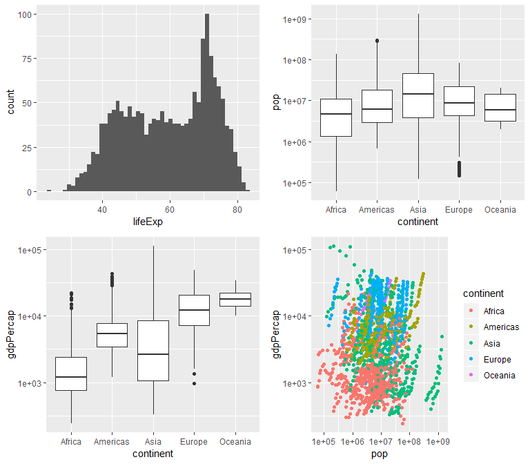
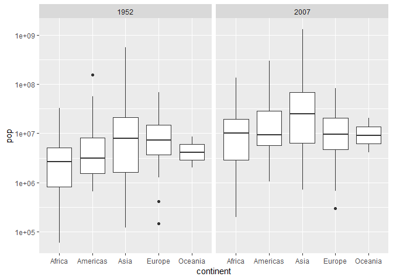
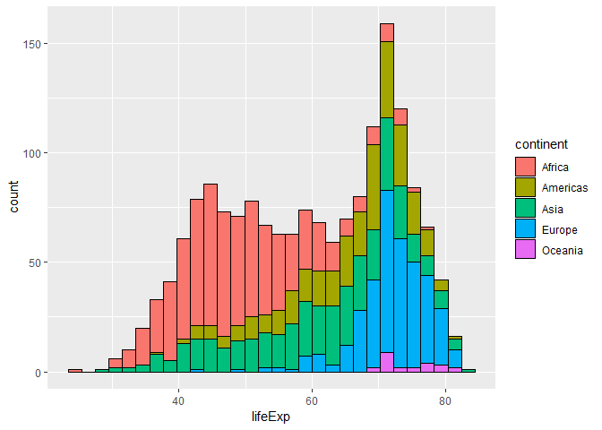
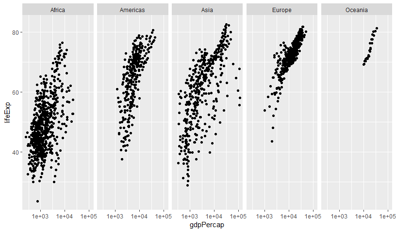
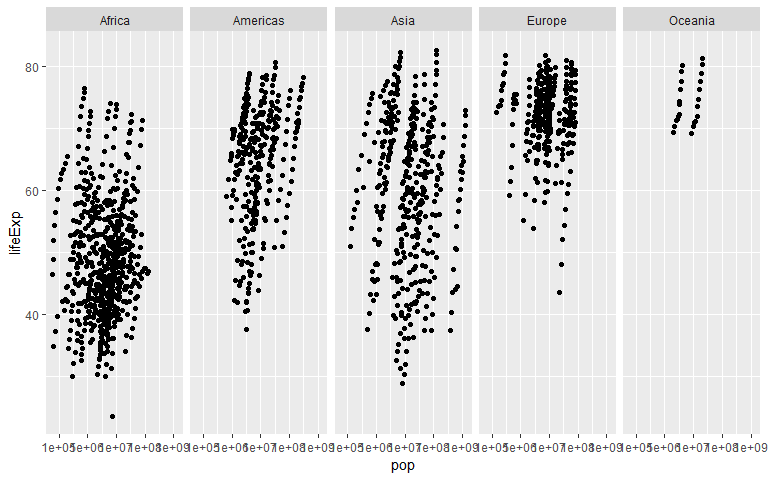
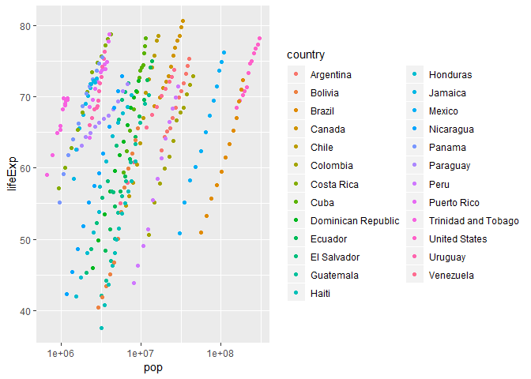

In this homework we are going to explore the Gapminder dataset to better understand how to familiarize yourself with new datasets, and to test drive the functionality of the tidyverse package. First let's begin by loading the tidyverse package and gapminder data: 


```r
suppressPackageStartupMessages(library(tidyverse))
library(gapminder)
library(knitr)
library(gridExtra)
```

```
## 
## Attaching package: 'gridExtra'
```

```
## The following object is masked from 'package:dplyr':
## 
##     combine
```

To explore the data, let's first examine what gapminder is and how it's represented and stored in R:


```r
typeof(gapminder)
```

```
## [1] "list"
```

```r
gapminder
```

```
## # A tibble: 1,704 x 6
##    country     continent  year lifeExp      pop gdpPercap
##    <fct>       <fct>     <int>   <dbl>    <int>     <dbl>
##  1 Afghanistan Asia       1952    28.8  8425333      779.
##  2 Afghanistan Asia       1957    30.3  9240934      821.
##  3 Afghanistan Asia       1962    32.0 10267083      853.
##  4 Afghanistan Asia       1967    34.0 11537966      836.
##  5 Afghanistan Asia       1972    36.1 13079460      740.
##  6 Afghanistan Asia       1977    38.4 14880372      786.
##  7 Afghanistan Asia       1982    39.9 12881816      978.
##  8 Afghanistan Asia       1987    40.8 13867957      852.
##  9 Afghanistan Asia       1992    41.7 16317921      649.
## 10 Afghanistan Asia       1997    41.8 22227415      635.
## # ... with 1,694 more rows
```

```r
class(gapminder)
```

```
## [1] "tbl_df"     "tbl"        "data.frame"
```

Based on this we can see that gapminder is stored in R as a list of columns (using 'typeof()'), which practically speaking, is a tibble or data.frame (the class of the object). Tibbles are updated versions of dataframes that are designed to be easier to work with and to align with the 'tidyverse' implementation of R. Next, let's see how much and what kinds of data are in this frame.


```r
ncol(gapminder)
```

```
## [1] 6
```

```r
nrow(gapminder)
```

```
## [1] 1704
```

```r
dim(gapminder)
```

```
## [1] 1704    6
```

We can see that this data frame contains 6 columns and 1704 rows. This information can be derived by looking at the results of calling gapminder, using nrow() and ncol(), or using dim(). These three options are beneficial for the user in different situations. For example, if you are simply checking that all of your data has been uploaded correctly, you can probably just glance at the dimensions printed by calling your tibble data frame. On the other hand, if you are trying to write a function to loop through all the rows or columns of your data, you will need a variable to store one or both of these values. nrow() and ncol() allow the user to access either the number of rows or the number of columns, while dim() creates a 2x1 vector that contains both the number of rows and the number of columns. 

Next, let's see what kinds of data are stored in our tibble data frame:


```r
str(gapminder)
```

```
## Classes 'tbl_df', 'tbl' and 'data.frame':	1704 obs. of  6 variables:
##  $ country  : Factor w/ 142 levels "Afghanistan",..: 1 1 1 1 1 1 1 1 1 1 ...
##  $ continent: Factor w/ 5 levels "Africa","Americas",..: 3 3 3 3 3 3 3 3 3 3 ...
##  $ year     : int  1952 1957 1962 1967 1972 1977 1982 1987 1992 1997 ...
##  $ lifeExp  : num  28.8 30.3 32 34 36.1 ...
##  $ pop      : int  8425333 9240934 10267083 11537966 13079460 14880372 12881816 13867957 16317921 22227415 ...
##  $ gdpPercap: num  779 821 853 836 740 ...
```

From this we can see that of the 6 variables, two are factors, two are integers, and two are numeric values. Exploring each of these variables a bit more, we can see:


```r
countryLevels <- levels(gapminder$country)
countryCounts <- table(gapminder$country)
continentLevels <- levels(gapminder$continent)
continentCounts <- table(gapminder$continent)
yearSummary <- summary(gapminder$year)
lifeExpSummary <- summary(gapminder$lifeExp)
popSummary <- summary(gapminder$pop)
gdpPerCapSummary <- summary(gapminder$gdpPercap)
```

Variable | Type | Range or Levels | Summary
------------|------------ |------------ |------------ 
country | Factor | 142 Levels, from Afghanistan-Zimbabwe | Each level occurs 12 times
continent | Factor | 5 Levels, from Africa-Oceania | Each levels occurs 24-624 times
year | Integer | 1952 - 2007 | Every 5th year from 1952-2007 with 142 data points for each year
lifeExp | Numeric | 23.6 - 82.6 | Q1 = 48.2, Q2 = 60.71, Q3 = 70.85, mean = 82.60
pop | Integer | 60011-1318683096 | Q1 = 2794000, Q2 = 7024000, Q3 = 19590000, mean = 29600000
gdpPercap | Numeric | 241.2 - 113523.1 | Q1 = 1202.1, Q2 = 3531.8, Q3 = 9325.5, mean = 7215.3

Let's try and get a sense for the spread of the data using plots. Given that there is no variability in the number of occurences of each country or year, and that the number of occurences of each continent is directly determined by the number of countries within the continent, let's stick to exploring the continuous variables that have variation with graphs.


```r
p1 <- ggplot(gapminder, aes(x=lifeExp)) +
  geom_histogram(bins = 50)
p2 <- ggplot(gapminder, aes(x=continent, y=pop)) +
 scale_y_log10() +
  geom_boxplot()
p3 <- ggplot(gapminder, aes(x=continent, y=gdpPercap)) +
 scale_y_log10() +
  geom_boxplot()
p4 <- ggplot(gapminder, aes(x=pop, y=gdpPercap)) +
  scale_y_log10() +
  scale_x_log10() +
  geom_point(aes(colour=continent))

grid.arrange(p1, p2, p3, p4,
             ncol = 2, nrow = 2)
```

<!-- -->

From these plots, we can see (clockwise from topleft):

* This shows the population has been distributed across all continents from 1952-2007. We can see that Asia and Africa have the greatest variability in population sizes, and that only Americas and Europe had country population sizes that were outliers. This makes me interested in comparing the distribution of country populations within a continent in 1952 compared to 2007.
* When considering population size and GDP per capita each on logarithmic scales, there does not appear to be a relationship. 
* When considering GDP per capita by continent, we can see that again, Asia has the greatest variability. This time, we also notice that Oceania has consistently high GDP per capita values, and low variability. This is likely also due to the lower sample size of Oceania compared to other continents. There are also outliers identified in Africa, the Americas, and Europe.
* Looking at the histogram of life expectancy, we can see that life expectancies range considerably, and that the distribution appears to be bimodal. This makes me curious to see how life expectancy interacts with the other variable plotted here.

Let's explore the questions generated in these first four plots:


```r
gapminder %>% filter(year == 1952 | year == 2007) %>% 
  ggplot(aes(x=continent, y=pop)) +
  scale_y_log10() +
  facet_grid(~year) +
  geom_boxplot()
```

<!-- -->

From these plots we can see that the approximate relative distribution of life expectancies between continents has remained relatively consistent from 1952 to 2007. All continents seem to have improved their life expectancies by comparable amounts.

Seeing how life expectancy interacts with continent:


```r
ggplot(gapminder, aes(lifeExp)) + 
  geom_histogram(aes(fill=continent), colour="black")
```

```
## `stat_bin()` using `bins = 30`. Pick better value with `binwidth`.
```

<!-- -->

From this we can see that the the bimodal nature of life expectancy can be attributed to the difference distributions for each continent. A large portion of the lower life expectancy values are due to the large number of African countries with lower life expectancies. In contrast, Europe, the Americas, and Oceania are a large portion of the higher life expectancy mode. 

Seeing how life expectancy interacts with GDP per capita:


```r
ggplot(gapminder, aes(x=gdpPercap, y=lifeExp)) +
  scale_x_log10() +
  facet_grid( ~ continent) +
  geom_point()
```

<!-- -->

From this we can see a general weak positive relationship between logarithmic GDP per capita and life expectancy. This seems reasonable as greater wealth could indicate better living conditions, and thus increased longevity. It makes sense that the relationship is weak, as there are many other factors that can contribute to life expectancy.

Seeing how life expectancy interacts with population size:


```r
ggplot(gapminder, aes(x=pop, y=lifeExp)) +
  scale_x_log10() +
  facet_grid( ~ continent) +
  geom_point()
```

<!-- -->

There seems to be a weak positive linear relationship between the logarithm of population size and life expectancy. I am curious based on these plots about the structure of this data as it appears there are lines of closely spaced data. This might mean that each of these lines are data for a single country. Let's investigate this further by examining only America, as that will be cleaner.


```r
gapminder %>% filter(continent=="Americas") %>% 
  arrange(year) %>% 
  ggplot(aes(pop, lifeExp)) +
  scale_x_log10() +
  geom_point(aes(colour=country))
```

<!-- -->

From this, we can see that yes, each line of data can be attributed to a single country. This means that most countries in the Americas have seen steady growths in both population size and life expectancy. 

##Extra

Evaluating the provided chunk of code:


```r
filter(gapminder, country == c("Rwanda", "Afghanistan"))
```

```
## # A tibble: 12 x 6
##    country     continent  year lifeExp      pop gdpPercap
##    <fct>       <fct>     <int>   <dbl>    <int>     <dbl>
##  1 Afghanistan Asia       1957    30.3  9240934      821.
##  2 Afghanistan Asia       1967    34.0 11537966      836.
##  3 Afghanistan Asia       1977    38.4 14880372      786.
##  4 Afghanistan Asia       1987    40.8 13867957      852.
##  5 Afghanistan Asia       1997    41.8 22227415      635.
##  6 Afghanistan Asia       2007    43.8 31889923      975.
##  7 Rwanda      Africa     1952    40    2534927      493.
##  8 Rwanda      Africa     1962    43    3051242      597.
##  9 Rwanda      Africa     1972    44.6  3992121      591.
## 10 Rwanda      Africa     1982    46.2  5507565      882.
## 11 Rwanda      Africa     1992    23.6  7290203      737.
## 12 Rwanda      Africa     2002    43.4  7852401      786.
```

This returns a tibble with 12 rows and 6 columns, where there are 6 rows for Rwanda and 6 rows for Afghanistan. Based on our previous analysis of the country variable, we know there should be 12 rows of data for both Rwanda and Afghanistan. If we were to correctly extract all data from Rwanda and Afghanistan, we would expect to have a 24x6 tibble returned. Examining our above result further, we can see that for each year, either Rwanda or Afghanistan have been selected, but never both. This is a result of filtering based on a vector of options. To return the full 24 rows of data the following code can be used:


```r
filter(gapminder, (country == "Rwanda" | country == "Afghanistan"))
```

```
## # A tibble: 24 x 6
##    country     continent  year lifeExp      pop gdpPercap
##    <fct>       <fct>     <int>   <dbl>    <int>     <dbl>
##  1 Afghanistan Asia       1952    28.8  8425333      779.
##  2 Afghanistan Asia       1957    30.3  9240934      821.
##  3 Afghanistan Asia       1962    32.0 10267083      853.
##  4 Afghanistan Asia       1967    34.0 11537966      836.
##  5 Afghanistan Asia       1972    36.1 13079460      740.
##  6 Afghanistan Asia       1977    38.4 14880372      786.
##  7 Afghanistan Asia       1982    39.9 12881816      978.
##  8 Afghanistan Asia       1987    40.8 13867957      852.
##  9 Afghanistan Asia       1992    41.7 16317921      649.
## 10 Afghanistan Asia       1997    41.8 22227415      635.
## # ... with 14 more rows
```

Now  we see that aa 24x6 tibble has been returned! Perfect.
